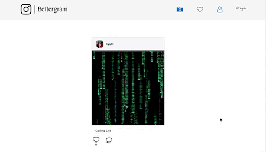

# Bettergram

An Instagram Clone application that contains some of the features that the real instagram has. Some of these features are likes,comments,profiles and others.

##### This is a Remake of a previous project this time leveraging TypeScript, making use of acutal queries instead of an ORM and implementing my own styling instead of using bootstrap

    

# features

### Likes

### Post 

### Feed

### Comment

### Profile

# Running App

Both the server and the client are intertwined with "concurrently", to start both just do from the root of the project:  
`yarn run dev`

